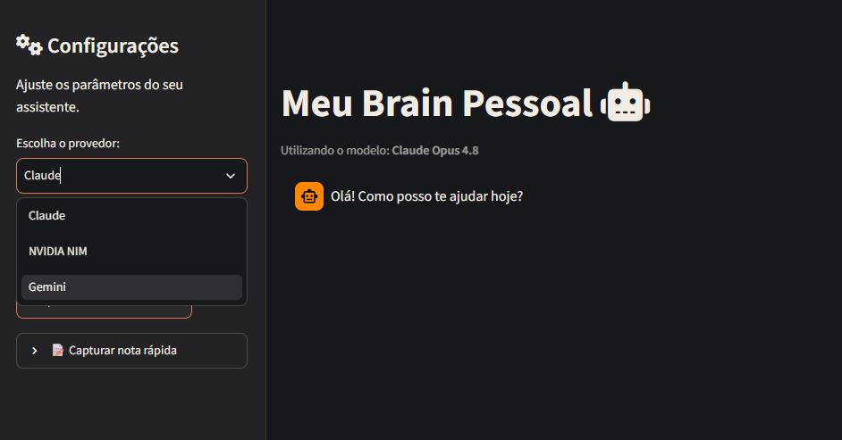
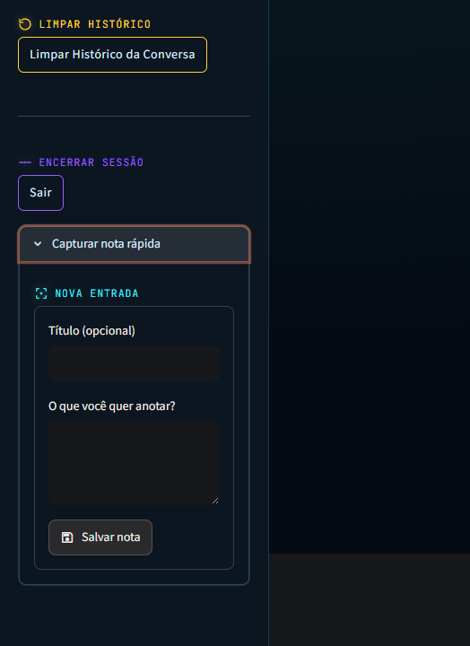

# Second Brain 24/7


Chatbot pessoal multi-provider com RAG sobre o meu próprio "second brain" (um vault do Obsidian), rodando em produção no Google Cloud Run com deploy automatizado via GitHub Actions.

Internamente o projeto é conhecido como `meu-claude-ui` (nome do serviço, dos buckets e do projeto GCP) — o repositório foi renomeado para `second_brain_24_7` porque é isso, na prática, que ele virou: uma forma de conversar com um LLM que enxerga o meu conhecimento pessoal, de qualquer lugar, a qualquer hora.

## Screenshots

| Chat multi-provider | Captura de notas |
|---|---|
|  |  |

## Por que esse projeto existe

Comecei este projeto como exercício de aprendizado prático de Cloud/DevOps (sou engenheiro de dados, não desenvolvedor de aplicações web) e ele evoluiu para uma ferramenta que uso diariamente. Não é um projeto de portfólio "de vitrine" — está em produção, recebe commits com frequência e resolve um problema real meu: eu escrevo muitas notas soltas (ideias, decisões, aprendizados de projetos no trabalho) e queria um jeito de conversar com esse conhecimento e de capturá-lo rapidamente, de qualquer dispositivo, sem fricção.

A stack e as decisões de arquitetura foram escolhidas deliberadamente para aprender, na prática, um conjunto de práticas modernas de deploy em nuvem: containers, CI/CD sem credenciais estáticas, gerenciamento de segredos, e RAG "de verdade" (com embeddings e busca por similaridade, não um wrapper de framework).

## Arquitetura

```
                        push na branch master
GitHub repo ─────────────────────────────────────► GitHub Actions
                                                     (auth via Workload
                                                      Identity Federation,
                                                      sem chave de service
                                                      account estática)
                                                            │
                                                            │ docker build + push
                                                            ▼
                                                   Artifact Registry
                                                            │
                                                            │ deploy
                                                            ▼
 usuário ──── HTTPS ────► Cloud Run (Streamlit, senha de app)
 (navegador/            │        │
  celular)               │        │
                         │        └──► Secret Manager
                         │             (ANTHROPIC_API_KEY, NVIDIA_API_KEY,
                         │              GEMINI_API_KEY, APP_PASSWORD)
                         │
                         ├──► Claude / NVIDIA NIM / Gemini (troca em runtime)
                         │
                         ├──► Cloud Storage: bucket de índice RAG
                         │        (vault_index.json com embeddings,
                         │         alerts.json com tarefas/prazos)
                         │
                         └──► Cloud Storage: bucket "inbox" de notas
                                  │
                                  │ pull_inbox.py (rodado localmente)
                                  ▼
                         Vault Obsidian local (00 - Entrada/)
```

A indexação do vault (`scripts/build_index.py`) e a geração de alertas (`scripts/build_alerts.py`) também rodam localmente, não no Cloud Run: elas leem os arquivos `.md` direto do vault no disco (via WSL) e geram `vault_index.json`/`alerts.json`, que depois são enviados manualmente para o bucket de índice. Isso evita ter que expor o vault inteiro para a nuvem — só o índice de embeddings e o resumo de tarefas sobem.

## Stack tecnológica

- **Frontend / app**: Python + [Streamlit](https://streamlit.io/)
- **LLMs**: Anthropic Claude (SDK oficial), NVIDIA NIM (via cliente OpenAI-compatible), Google Gemini (`google-genai`)
- **Embeddings**: NVIDIA NV-Embed (`nvidia/nemotron-3-embed-1b`), via NVIDIA NIM
- **Busca vetorial**: NumPy (similaridade de cosseno em memória — sem banco vetorial dedicado, o índice cabe tranquilamente em memória)
- **Empacotamento**: Docker (`python:3.12-slim`)
- **Deploy**: Google Cloud Run
- **CI/CD**: GitHub Actions + Workload Identity Federation (sem JSON de service account)
- **Segredos**: Google Secret Manager
- **Armazenamento**: Google Cloud Storage (bucket de índice RAG + bucket de inbox de notas)
- **Registro de imagens**: Google Artifact Registry

## Funcionalidades

### Multi-provider com troca em tempo real
A barra lateral permite trocar de provedor (Claude, NVIDIA NIM, Gemini) e de modelo a qualquer momento, inclusive no meio de uma conversa. O histórico de mensagens é preservado ao trocar de provider — decisão deliberada: cada provider tem seu próprio adapter (`stream_response`, `stream_nvidia`, `stream_gemini` em `src/business_logic.py`) que recebe o mesmo formato interno de mensagens e o traduz para o formato esperado pela respectiva API (por exemplo, Gemini exige `role: "model"` em vez de `"assistant"`).

### RAG sobre o vault pessoal
Cada pergunta do usuário é usada para buscar, por similaridade de cosseno, os trechos mais relevantes do vault indexado (`src/rag.py`), que são injetados como contexto na mensagem antes de ir para o LLM. O vault inteiro é indexado por `scripts/build_index.py`, que:
- percorre o vault local em busca de arquivos `.md`;
- pula pastas sensíveis (`.obsidian`, `09 - Sistema`, `.git`);
- pula qualquer nota cujo frontmatter contenha `classificacao: corporativo` (proteção explícita contra vazar conteúdo de trabalho no índice);
- quebra o texto em chunks por parágrafo (~1500 caracteres);
- gera embeddings e grava tudo em `vault_index.json`, que depois é enviado ao bucket de índice.

### Captura de notas via app
O caminho inverso do RAG: um formulário na barra lateral permite escrever uma nota rapidamente, de qualquer lugar, que vai direto para um bucket "inbox" no Cloud Storage (`src/inbox.py`). Depois, rodando localmente, `scripts/pull_inbox.py` traz essas notas de volta para `00 - Entrada/` no vault e apaga o blob do bucket.

### Painel de alertas (tarefas e prazos)
Um expander no topo da página mostra tarefas pendentes com prazo, sem gastar nenhuma chamada de LLM: notas do vault marcadas com o frontmatter `tipo: tarefa` (mais `prazo`, `projeto` opcional e `status: pendente`) são varridas localmente por `scripts/build_alerts.py`, que gera um `alerts.json` simples (sem embeddings, sem IA) e o envia pro mesmo bucket do índice RAG. O app (`src/alerts.py`) só lê e ordena esse JSON por proximidade do prazo, destacando 🔴 atrasadas e 🟡 vencendo nos próximos 3 dias. O painel some sozinho se não houver tarefa pendente, e abre recolhido a menos que exista algo atrasado.

## Decisões de design

- **Sincronização em lote, não em tempo real.** Tanto a indexação do vault quanto a captura de notas são processos em lote, disparados manualmente (rodar um script). Foi uma escolha consciente: um projeto anterior meu travou tentando resolver sincronização em tempo real (webhooks/watchers) entre o vault e um serviço externo. Aqui, "puxar quando eu quiser" é mais simples de operar e suficiente para o meu uso.
- **Embeddings assimétricos.** A indexação usa `input_type=passage` e a busca usa `input_type=query` — o modelo NV-Embed foi treinado para tratar documentos e perguntas de forma diferente, e usar o `input_type` errado degrada a qualidade da busca por similaridade.
- **Histórico preservado ao trocar de provider.** Trocar de LLM no meio da conversa não reseta o contexto. Isso significa que um provider às vezes "vê" uma resposta que ele mesmo não gerou — um trade-off aceito em troca de poder comparar respostas de modelos diferentes sem perder o fio da conversa.
- **Sem banco vetorial dedicado.** O índice do vault é pequeno o suficiente para caber inteiro em memória; comparar embeddings com NumPy é mais simples de operar (e de debugar) do que subir um Pinecone/Weaviate/pgvector para esse volume de dados.
- **Autenticação sem identidade federada.** Como é uma aplicação de uso pessoal exposta publicamente (`--allow-unauthenticated` no Cloud Run), o acesso é protegido por uma senha simples (`APP_PASSWORD`, guardada no Secret Manager) em vez de OAuth/IAP — suficiente para o risco real do projeto, sem a complexidade de configurar identidade federada para um usuário só.
- **CI/CD sem chaves estáticas.** O workflow de deploy autentica no GCP via Workload Identity Federation, trocando um token de curta duração do GitHub por credenciais do GCP — nenhuma chave de service account em JSON fica armazenada como secret do GitHub.
- **Alertas via dado estruturado, não LLM.** O painel de tarefas/prazos foi desenhado deliberadamente para não usar RAG nem qualquer chamada de LLM: RAG serve pra "achar o que é relevante pra uma pergunta" (busca aproximada, top-k), enquanto o painel precisa ser exato e completo (todas as tarefas pendentes, ordenadas por prazo). Frontmatter estruturado + leitura direta de JSON garante isso sem custo de API.
- **Tarefa concluída = frontmatter removido, não `status: concluído`.** Deixar tarefas concluídas marcadas indefinidamente acumularia metadado morto no vault. Concluir uma tarefa significa apagar os 4 campos de frontmatter da nota, não sinalizar outro status.
- **System prompt genérico contra alucinação de identidade via RAG.** O RAG sempre retorna os top-k chunks mais próximos, mesmo sem nenhum match relevante — numa pergunta vaga (ex: "quem é você?"), isso pode trazer notas de projetos antigos/descontinuados que descrevem um "assistente"/"copiloto", e sem instrução o LLM monta uma identidade falsa a partir disso. Corrigido com um `SYSTEM_PROMPT` (aplicado nos 3 providers) deixando explícito que o contexto do RAG é material de referência, não uma descrição do próprio assistente. Deliberadamente genérico — sem mencionar projetos específicos — pra não precisar mexer nesse código de novo a cada projeto arquivado.

## Como rodar localmente

Pré-requisitos: Python 3.12+, uma conta GCP com os buckets/segredos configurados (para RAG e captura de notas) e chaves de API dos provedores que você quiser usar.

```bash
git clone <url-do-repo>
cd second_brain_24_7

python3 -m venv .venv
source .venv/bin/activate
pip install -r requirements.txt
```

Crie um arquivo `.env` na raiz do projeto com as variáveis necessárias:

```bash
ANTHROPIC_API_KEY=sk-ant-...
NVIDIA_API_KEY=nvapi-...
GEMINI_API_KEY=...
APP_PASSWORD=escolha-uma-senha
```

Rode a aplicação:

```bash
streamlit run src/main.py
```

Para rodar via Docker (equivalente ao que roda em produção):

```bash
docker build -t second-brain-24-7 .
docker run -p 8501:8501 --env-file .env second-brain-24-7
```

### Indexando o vault para o RAG

```bash
python scripts/build_index.py
```

Isso lê o vault do Obsidian localmente e gera `vault_index.json`. O arquivo depois precisa ser enviado ao bucket de índice no Cloud Storage (o script não faz isso automaticamente).

### Gerando o painel de alertas

Marque notas do vault com o frontmatter abaixo (só nas que forem tarefa/compromisso com prazo):

```yaml
tipo: tarefa
titulo: Nome legível para o painel  # opcional, senão usa o nome do arquivo
prazo: 2026-08-01
projeto: nome-do-projeto  # opcional
status: pendente
```

Quando a tarefa for concluída, não existe um valor `status: concluído` — remova os 5 campos de frontmatter da nota (ela volta a ser uma nota normal). Isso evita acumular, indefinidamente, notas marcadas como tarefa "morta" no vault.

Depois rode:

```bash
python scripts/build_alerts.py
```

Isso gera `alerts.json` localmente. Envie pro mesmo bucket do índice RAG (`meu-claude-ui-2026-rag-index`), por exemplo com `gcloud storage cp alerts.json gs://meu-claude-ui-2026-rag-index/alerts.json`.

### Trazendo notas capturadas pelo app de volta pro vault

```bash
python scripts/pull_inbox.py
```

## Deploy

O deploy é 100% automatizado: qualquer push na branch `master` dispara o workflow em `.github/workflows/deploy.yml`, que:

1. autentica no GCP via Workload Identity Federation (sem chave de service account);
2. builda a imagem Docker e publica no Artifact Registry;
3. faz o deploy no Cloud Run, injetando os segredos (`ANTHROPIC_API_KEY`, `NVIDIA_API_KEY`, `GEMINI_API_KEY`, `APP_PASSWORD`) via `--update-secrets`, apontando para o Secret Manager.

O serviço roda com uma service account dedicada (`chatbot-sa`), com permissão mínima (apenas leitura dos segredos e acesso aos buckets que usa) em vez da service account padrão do projeto.

## Estrutura do projeto

```
.
├── Dockerfile
├── requirements.txt
├── .streamlit/config.toml       # tema dark do Streamlit
├── .github/workflows/deploy.yml # pipeline de CI/CD
├── scripts/
│   ├── build_index.py           # indexa o vault (RAG) — roda localmente
│   ├── build_alerts.py          # gera o painel de tarefas/prazos — roda localmente
│   └── pull_inbox.py            # traz notas capturadas de volta pro vault
└── src/
    ├── main.py                  # entrypoint da app Streamlit
    ├── business_logic.py        # adapters dos providers de LLM
    ├── ui_components.py         # componentes de UI (sidebar, chat, captura de notas, alertas)
    ├── rag.py                   # busca por similaridade sobre o índice do vault
    ├── alerts.py                # lê o painel de alertas (alerts.json) do bucket
    ├── inbox.py                 # salva notas capturadas no bucket de inbox
    └── assets/style.css
```

## Status

Projeto pessoal, em uso e evolução contínua. Não está aberto a contribuições externas (é uma ferramenta feita para o meu próprio fluxo de trabalho), mas o código é público como referência de arquitetura para quem quiser estudar o padrão Streamlit + Cloud Run + CI/CD com Workload Identity Federation, ou a implementação de RAG "do zero" sem framework.

## Licença

Todos os direitos reservados — veja [LICENSE](LICENSE). O código é público apenas para leitura e estudo, sem permissão de reuso.
